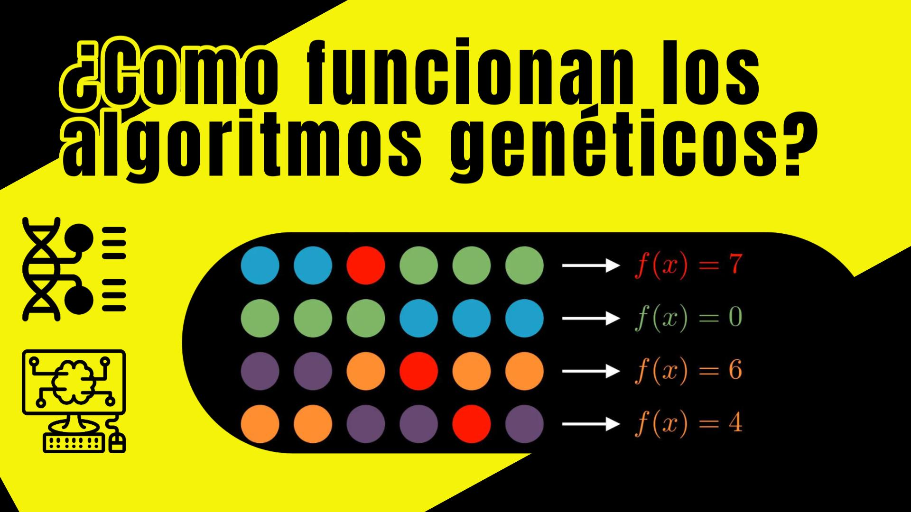

## 📢 Sigue el proyecto CodeDog
¡Bienvenido a este repositorio! 👋  
Aquí encontrarás el código utilizado en uno de los videos del proyecto **CodeDog** 🐶💻, donde exploramos conceptos fascinantes del mundo de las **Ciencias de la Computación** de forma clara y práctica, incluyendo temas como:
- 🤖 **Machine Learning**
- 🧠 **Inteligencia Artificial**
- 🧬 **Inteligencia Computacional**

Si te interesa aprender más sobre estos temas y apoyar el contenido, no olvides seguirnos en nuestras redes sociales:
- ▶️ **[YouTube](https://www.youtube.com/channel/UCc6iP4H2xYFXYGkSx9Xtmig)**
- 📘 **Facebook**
- 📸 **Instagram**
- 🎵 **TikTok**

¡Gracias por visitar el repositorio y feliz programación! 🚀🐾


# 🧬 Algoritmos Genéticos con Python
Este repositorio contiene el codigo usado en el video [YYY](AlgGen.py), en el cual se explica detalladamente el funcionamiento de los algoritmos geneticos de variable real, se realiza un implementación con python y se realizan algunos experimentos.




## Instalación
Descarga o clona este proyecto:
```bash
git clone https://github.com/codedog-videos/Algoritmos-Geneticos-REP.git
```

Encontraras los siguientes archivos:
 - [AlgGen.py](AlgGen.py): codigo del algoritmo genetico implementado y ejemplo de como correr un experimento (el resultado se almacena en un archivo csv).
 - [Animaciones](Animaciones): esta carpeta muestra la implementacion en Manim de las animaciones usadas para este video.